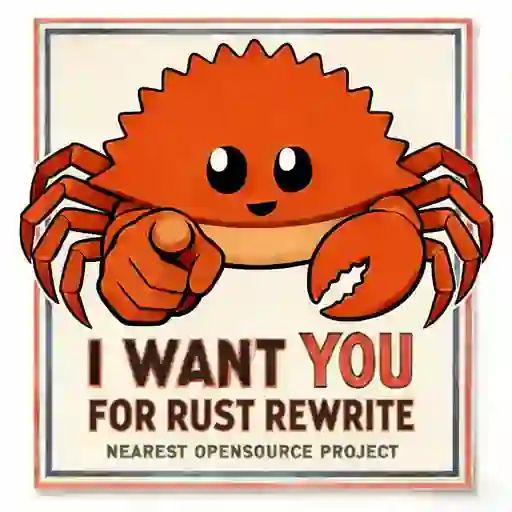

  

> Any application that can be written in <ruby>Rust <rp>(</rp><rt>~~JavaScript~~</rt><rp>)</ruby>, will eventually be written in <ruby>Rust <rp>(</rp><rt>~~JavaScript~~</rt><rp>)</ruby>.

# Rust Crusade

An awesome list on which projects can be rewritten in Rust.

## Methodology

1. Find starred projects on GitHub
2. For each project, search in issue/discussion:
   - complaints (performance slow or feature missing)
   - performance related features
3. Fewrite it in rust

## Outcome

- Files: RDF, especially TOON-LD.
- Visualization: GitHub Pages, RDF HDT

## Automation

GitHub has many repos:

| stars | count     |
| ----- | --------- |
| >1000 | 50000     |
| >100  | 350000    |
| >5    | 3 million |

--and for each repo, we have to read through all issues and code.

So automation is necessary, first filter with API and LLM, then human edit.

## For whom

- rust newbie for practice
- to earn stars with rust

## Useful Resources

- [Pelmers's GitHub Metadata](https://github.com/pelmers/github-repository-metadata): outdated but comprehensive
